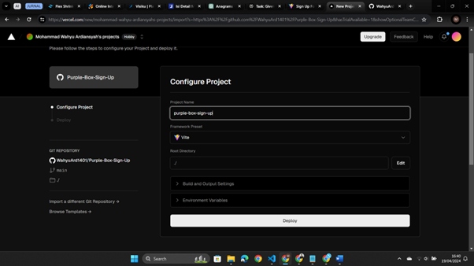

# Purple Box Sign Up

This project was built using the Vite.js and React.js frameworks
## Project details:
- React Context: used for state management
- React router: to manage routing
- Tailwind : designing the interface

## Deployment stage:

 
- Click Add New -> Project
 
 

 
- Import the project you want to deploy
 
 

 
- Then click Deploy
 
 

 
- The project has been successfully deployed, click continue to dashboard
 
 

 
- Click Visit to see projects that have been successfully deployed